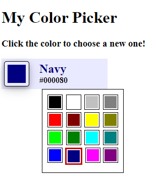

# Exercise

For this excercise you will be writing your own color picker component! 
You are free to build this component any way you'd like. I have included
an Angular 12 starting application along with a template to get you started. Under the `services` folder you will find
a service called `ColorService` in the `color.service.ts file`. This service will
return an observable of `Colors` you can use to populate your color picker.

Here is an example of what you're looking to build. 

## Requirements:
- Build a component that shows the current selected color, color name, and the color value (default to Black)
- When the color is clicked, a color selector appears displaying the colors from the `ColorService`
- Highlight the currently selected color in the color selector when it is opened
- When a color is selected, the color selector closes and the main component updates with the selected color

Styling is completely up to you. I encourage you to be creative! However, functionality is more important 😉

Good luck!

# Instructions
You'll first need to navigate to [https://stackblitz.com/edit/angular-color-picker-exercise](https://stackblitz.com/edit/angular-color-picker-exercise).

Once there, click the Fork Icon in the top menu. 
You shouldn't need to sign in, but you're welcome to.

Once you finish the exercise go ahead and save the project. Then using the `Share` button, copy the `Editor URL` and send the URL back to us.

 

---

 
 

# ColorPickerApp

This project was generated with [Angular CLI](https://github.com/angular/angular-cli) version 12.0.4.

## Development server

Run `ng serve` for a dev server. Navigate to `http://localhost:4200/`. The app will automatically reload if you change any of the source files.

## Code scaffolding

Run `ng generate component component-name` to generate a new component. You can also use `ng generate directive|pipe|service|class|guard|interface|enum|module`.

## Build

Run `ng build` to build the project. The build artifacts will be stored in the `dist/` directory.

## Running unit tests

Run `ng test` to execute the unit tests via [Karma](https://karma-runner.github.io).

## Running end-to-end tests

Run `ng e2e` to execute the end-to-end tests via a platform of your choice. To use this command, you need to first add a package that implements end-to-end testing capabilities.

## Further help

To get more help on the Angular CLI use `ng help` or go check out the [Angular CLI Overview and Command Reference](https://angular.io/cli) page.
